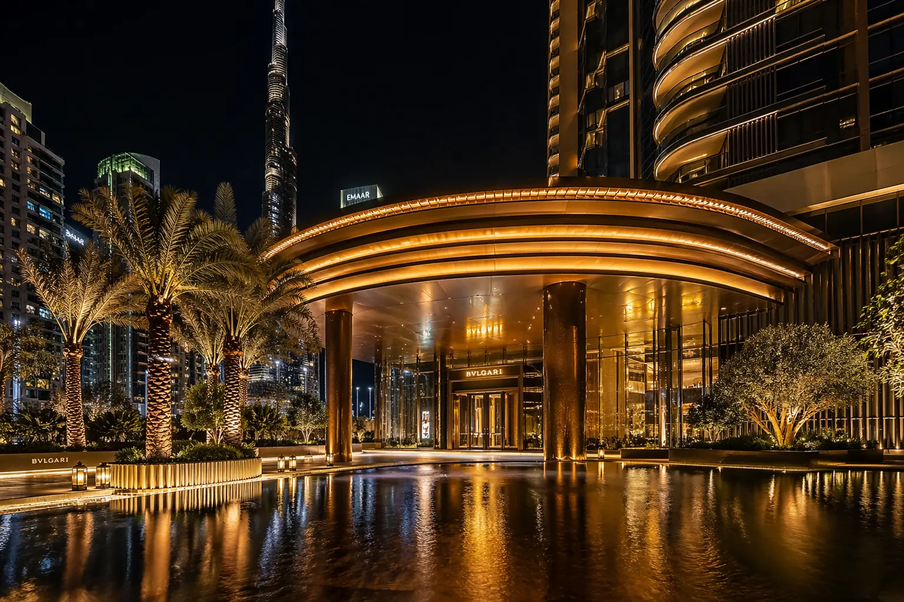
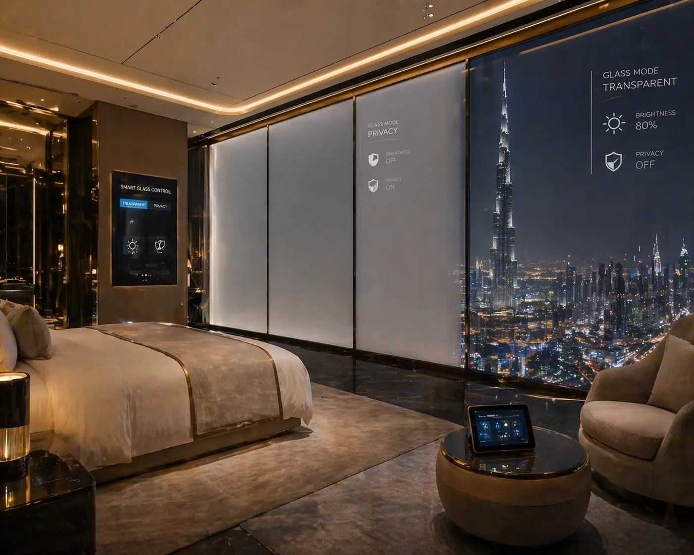
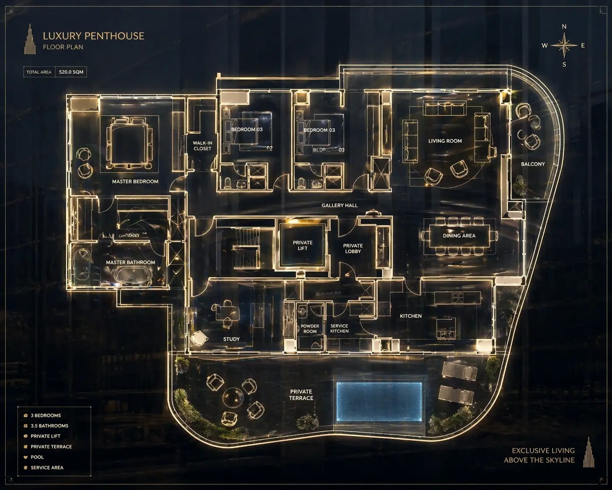

---

# 🏨 Nova Horizon — Intelligence Resorts Network (Hotel Future)

<p align="center">
  <a href="https://ostrovskyiv.github.io/hotel-future/">
    
  </a>
  <a href="https://github.com/ostrovskyiv/hotel-future/actions">
    
  </a>
</p>

---

## 🌍 Language / Язык
*Click on a section below to expand it / Нажмите на секцию ниже, чтобы развернуть её*

---

<details>
<summary><b>[ US ] ENGLISH VERSION — PROJECT OVERVIEW</b></summary>
<br>

### 🌟 Concept
**Nova Horizon** is a conceptual luxury hotel network of the future, developed as a university project. The site presents a global ecosystem of "intelligent" resorts (Dubai, Shanghai, Antalya, Tokyo) managed by the proprietary **NovaOS** artificial intelligence. The design focuses on high-end minimalist aesthetics and futuristic functionality.

### 🛠 Key Features & Pages
*   **🏠 Home Page:** A grand introduction to the resort with a cinematic hero section and core value propositions: Privacy, AI-Service, and Eco-Sustainability.
*   **🧬 Tech Roadmap (2030):** An interactive encyclopedia of hotel technologies. Users can explore modules like Neuro-Atmosphere, Quantum Concierge, and Biometric Layers.
*   **🗺 Floor Plan (Map):** A detailed architectural visualization of the penthouse and spa zones with interactive points and live occupancy status.
*   **🤝 Partnership (Invest):** A corporate section showcasing global investors and a detailed "Innovation Network" grid with technical specifications for each module.
*   **🛎 Real-time Booking Engine:** A sophisticated fake booking system that generates **randomized viewer statistics** for each hotel to simulate high demand.

### 💻 Tech Stack & Architecture
*   **Architecture:** **FSD (Feature-Sliced Design)** — a professional architectural methodology for scalable and maintainable code.
*   **Framework:** Vue 3 (Composition API), TypeScript.
*   **Styles:** Tailwind CSS (Custom premium theme).
*   **Icons:** Lucide Vue.
*   **Build Tool:** Vite.

### ⚖️ Academic Note
> This project was created as a university assignment to demonstrate UI/UX skills and modern frontend architecture in the context of the hospitality industry of the future.

### 📞 Contact
*   **Telegram:** [@Bambuk_lov](https://t.me/Bambuk_lov)
*   **Email:** [ostrovskyiml@gmail.com](mailto:ostrovskyiml@gmail.com)

---
</details>

<details>
<summary><b>[ RU ] РУССКАЯ ВЕРСИЯ — ОБЗОР ПРОЕКТА</b></summary>
<br>

### 🌟 Концепция
**Nova Horizon** — это концептуальный проект сети отелей будущего, разработанный в рамках университетского задания. Сайт представляет глобальную экосистему «интеллектуальных» курортов (Дубай, Шанхай, Анталья, Токио), управляемых искусственным интеллектом **NovaOS**. Дизайн выполнен в стиле «цифрового люкса».

### 🛠 Описание страниц и функций
*   **🏠 Главная страница:** Элегантное приветствие с кинематографическим фоном и ключевыми ценностями: Приватность, ИИ-Сервис и Эко-технологии.
*   **🧬 Технологии (Roadmap 2030):** Интерактивная энциклопедия инноваций. Пользователи могут изучать модули: Нейро-Среда, Квантовый консьерж и Биометрический вход.
*   **🗺 Карта номеров:** Архитектурная визуализация пентхаусов и спа-зон с интерактивными точками интереса и статусом загрузки этажей.
*   **🤝 Партнерство (Инвестиции):** Корпоративный раздел со списком глобальных инвесторов и подробной сеткой «Сеть инноваций», раскрывающей технические детали каждого модуля.
*   **🛎 Система бронирования:** Продвинутая имитация бронирования, которая генерирует **случайное количество просмотров** для каждого отеля в реальном времени.

### 💻 Стек технологий и Архитектура
*   **Архитектура:** **FSD (Feature-Sliced Design)** — строгое разделение кода на слои (entities, features, widgets, pages) для максимальной чистоты и масштабируемости.
*   **Фреймворк:** Vue 3 (Composition API), TypeScript.
*   **Стили:** Tailwind CSS (Премиальная темная тема).
*   **Иконки:** Lucide Vue.
*   **Сборка:** Vite.

### ⚖️ Учебные цели
> Проект реализован для демонстрации навыков проектирования интерфейсов (UI/UX) и владения современной архитектурой фронтенд-приложений на примере индустрии гостеприимства будущего.

### 📞 Контакты
*   **Telegram:** [@Bambuk_lov](https://t.me/Bambuk_lov)
*   **Email:** [ostrovskyiml@gmail.com](mailto:ostrovskyiml@gmail.com)

---
</details>

---

## 📸 Screenshots / Скриншоты





---

## 🚀 Installation / Установка

```bash
# Clone / Клонировать
git clone https://github.com/ostrovskyiv/hotel-future.git

# Install / Установить
npm install

# Run / Запустить
npm run dev
```

---

## 🔗 Live Demo / Демо онлайн
[Посмотреть Nova Horizon Live](https://ostrovskyiv.github.io/hotel-future/)